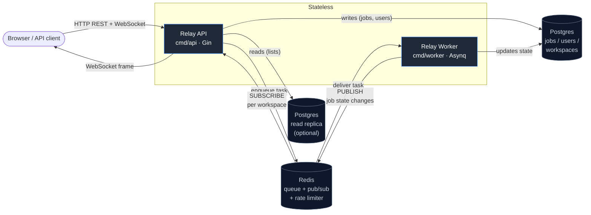

# Relay

A distributed task-queue and async-workflow engine in Go — a lightweight Temporal/Sidekiq built to exercise the patterns senior backend interviews ask about.

What it does:

- **Durable jobs** with at-least-once delivery, idempotency keys, exponential backoff with full jitter, and a dead-letter terminal state.
- **DAG dependencies** — jobs can `depends_on` other jobs; the scheduler releases blocked jobs as upstream deps succeed, cancels them when an upstream dies.
- **Real-time fan-out** — every state transition is published to Redis pub/sub and broadcast to subscribed WebSocket clients across all API instances.
- **Multi-tenant auth** — JWT access tokens + rotating refresh tokens with family-based theft detection, RBAC, per-workspace rate limiting.
- **Production hygiene** — `SELECT FOR UPDATE SKIP LOCKED` for safe job claiming, optimistic version locking on transitions, keyset pagination, read-replica routing, OpenTelemetry tracing, pprof.

## Architecture



**Read it as:** API and Worker are horizontally scalable stateless processes. Postgres is the durable record (job state, audit log, users); Redis is the throughput layer (Asynq queue for delivery, pub/sub for real-time fan-out, token buckets for rate limiting). Workers publish state changes through Redis, and every API instance's hub picks them up — so a WebSocket client connected to any instance sees every job's progress in real time.

## Quick start

```bash
git clone <repo> && cd Relay/relay
docker compose up --build
```

After ~30s you'll have:

- API on **http://localhost:8081**
- Dashboard on **http://localhost:8081/**  (vanilla HTML/JS — register, enqueue, watch jobs live)
- Asynqmon on **http://localhost:8080**  (queue/worker introspection UI)
- Postgres on `:5432`, Redis on `:6379`

The `migrate` compose service runs schema migrations once before api/worker boot, so the first request lands on a ready database.

## Walkthrough (curl)

End-to-end without leaving the terminal. Assumes `jq` for readability — drop the `| jq` if you don't have it.

```bash
# 1. Register a workspace + first user (the user becomes its owner)
curl -s http://localhost:8081/v1/auth/register \
  -H 'Content-Type: application/json' \
  -d '{
    "email": "demo@example.com",
    "password": "demo-password-1234",
    "workspace_name": "Demo",
    "workspace_slug": "demo"
  }' | jq
# → 201 with { user, workspace, tokens: { access_token, refresh_token, ... } }
```

```bash
# 2. Log in and grab the access token into a shell var
TOKEN=$(curl -s http://localhost:8081/v1/auth/login \
  -H 'Content-Type: application/json' \
  -d '{"email":"demo@example.com","password":"demo-password-1234"}' \
  | jq -r .data.tokens.access_token)
echo "$TOKEN" | head -c 40 ; echo …
```

```bash
# 3. Confirm the token round-trips
curl -s http://localhost:8081/v1/me \
  -H "Authorization: Bearer $TOKEN" | jq
# → { user: {...}, workspace: {...} }
```

```bash
# 4. Create a pipeline (workspace-scoped container for jobs)
curl -s http://localhost:8081/v1/pipelines \
  -H "Authorization: Bearer $TOKEN" \
  -H 'Content-Type: application/json' \
  -d '{"name":"Daily ETL","slug":"daily-etl"}' | jq
# → 201 pipeline object
```

```bash
# 5. Enqueue a noop job — succeeds instantly
JOB_A=$(curl -s http://localhost:8081/v1/pipelines/daily-etl/jobs \
  -H "Authorization: Bearer $TOKEN" \
  -H 'Content-Type: application/json' \
  -d '{"kind":"noop","payload":{}}' \
  | jq -r .data.id)
echo "enqueued $JOB_A"
```

```bash
# 6. Enqueue a job that depends on the first one (DAG)
curl -s http://localhost:8081/v1/pipelines/daily-etl/jobs \
  -H "Authorization: Bearer $TOKEN" \
  -H 'Content-Type: application/json' \
  -d "{\"kind\":\"delay\",\"payload\":{\"ms\":500},\"depends_on\":[\"$JOB_A\"]}" | jq
# → state: "blocked" until JOB_A reaches "succeeded", then released to "pending"
```

```bash
# 7. List recent jobs (keyset-paginated)
curl -s 'http://localhost:8081/v1/jobs?limit=10' \
  -H "Authorization: Bearer $TOKEN" | jq '.data.jobs[] | {id, kind, state, attempts}'
```

```bash
# 8. Inspect the audit history for one job
curl -s "http://localhost:8081/v1/jobs/$JOB_A/events" \
  -H "Authorization: Bearer $TOKEN" | jq '.data[] | {event, from_state, to_state, message, created_at}'
```

```bash
# 9. Subscribe to live updates (needs `websocat` — brew/apt install)
websocat "ws://localhost:8081/v1/ws/jobs?token=$TOKEN"
# Re-run step 5 in another shell — you'll see job.enqueued → job.started →
# job.succeeded frames arrive in real time.
```

## Endpoints

| Method | Path                                | Auth              | Notes |
|--------|-------------------------------------|-------------------|-------|
| GET    | `/healthz`                          | none              | liveness probe |
| GET    | `/`                                 | none              | dashboard (vanilla HTML/JS) |
| POST   | `/v1/auth/register`                 | none              | creates workspace + first user |
| POST   | `/v1/auth/login`                    | none              | returns access + refresh tokens |
| POST   | `/v1/auth/refresh`                  | none              | rotates refresh; family killed on replay |
| POST   | `/v1/auth/logout`                   | none              | revokes a refresh token |
| GET    | `/v1/me`                            | Bearer            | who-am-i |
| POST   | `/v1/pipelines`                     | Bearer            | create pipeline |
| GET    | `/v1/pipelines`                     | Bearer            | list pipelines |
| POST   | `/v1/pipelines/:slug/jobs`          | Bearer            | enqueue job (`kind`, `payload`, optional `depends_on`, `idempotency_key`, `max_attempts`, `scheduled_at`) |
| GET    | `/v1/jobs`                          | Bearer            | keyset list, filter `?state=`, `?limit=`, cursor `?before=&before_id=` |
| GET    | `/v1/jobs/:id`                      | Bearer            | one job |
| GET    | `/v1/jobs/:id/events`               | Bearer            | audit history |
| GET    | `/v1/ws/jobs`                       | Bearer or `?token=` | WebSocket stream of workspace job events |
| GET    | `/debug/pprof/*`                    | none (non-prod)   | CPU / heap / goroutine profiles |

## Built-in job kinds

Register your own in `cmd/worker/main.go` via `job.Registry.Register("kind", executor)`.

| Kind  | Payload                                                  | Behaviour |
|-------|----------------------------------------------------------|-----------|
| noop  | `{}`                                                     | always succeeds |
| delay | `{ "ms": 1000 }`                                         | sleeps then succeeds |
| http  | `{ "method":"GET", "url":"...", "headers":{}, "body":"" }` | non-2xx → error (triggers retry path) |

## Layout

```
.
├── relay/                   # Go module
│   ├── cmd/
│   │   ├── api/             # HTTP server (Gin), auto-migration boot mode, pprof
│   │   └── worker/          # Asynq consumer with built-in retry backoff + jitter
│   ├── internal/
│   │   ├── auth/            # 4-layer (model/dto/repository/service/handler) + JWT
│   │   ├── job/             # 4-layer + executor registry + Asynq enqueuer
│   │   ├── hub/             # Redis pub/sub subscriber + bounded fan-out + WS handler
│   │   ├── middleware/      # request id, auth (incl. WS query-token variant), rbac, rate limit (Lua), access log
│   │   └── server/          # pgxpool (primary + optional read replica), redis client, OTel, embedded-migration runner
│   ├── pkg/{config,logger,response}/
│   ├── migrations/          # SQL files + embed.FS go file (golang-migrate compatible)
│   ├── scripts/k6/load.js   # k6 load test
│   ├── web/                 # static dashboard served at /
│   ├── Dockerfile           # multi-stage; targets `api` and `worker`
│   └── docker-compose.yml   # postgres + redis + asynqmon + migrate + api + worker
├── render.yaml              # Render Blueprint (Postgres + Redis + api + worker)
└── .github/workflows/ci.yml # vet + build + test -race on push
```

## Deploy to Render

Render reads `render.yaml` at the repo root and provisions everything in one click.

1. Push this repo to GitHub.
2. In the Render dashboard: **New → Blueprint** → pick the repo. Render previews 3 resources: Postgres, Redis, and the api web service.
3. Approve. Render builds the Docker image, provisions Postgres + Redis, and wires `DATABASE_URL` / `REDIS_URL` into the api automatically.

### Two deployment shapes

The blueprint defaults to **colocated mode** — one free web service runs both HTTP and the Asynq worker in the same process (`APP_RUN_WORKER_IN_PROCESS=true`). This keeps the deploy at **$0/month** but inherits the free tier's 15-minute sleep timer (jobs only execute while someone's poking the service).

For **production scale-out**, edit `render.yaml`:
- Drop `APP_RUN_WORKER_IN_PROCESS` from the api service.
- Uncomment the `relay-worker` service block at the bottom.
- (Optional) Bump `relay-api` from `free` to `starter` so the api never sleeps.

That gives you two independent processes for ~$7/mo (separate background worker).
4. The api boots with `APP_AUTO_MIGRATE=true`, so embedded migrations run before HTTP serving begins on first deploy. JWT secrets are auto-generated.

The starter plans cost ~$7/svc/month for paid tiers; the free `redis` and `postgres` instances have storage caps that are fine for evaluation but not production.

To redeploy after code changes: `git push` — `autoDeploy: true` kicks Render into rebuilding both services.

## Production knobs

| Env var                 | Default       | Notes |
|-------------------------|---------------|-------|
| `APP_ENV`               | development   | `production` disables pprof + Gin debug output |
| `APP_PORT` / `PORT`     | 8081          | Render injects `PORT`; the app reads either |
| `APP_AUTO_MIGRATE`      | false         | when true, api applies embedded migrations at boot (set in `render.yaml`) |
| `DATABASE_URL`          | required      | primary Postgres DSN |
| `DATABASE_READ_URL`     | empty         | optional read-replica DSN — list queries route here |
| `REDIS_URL`             | one of these  | full `redis://...` URL — preferred |
| `REDIS_ADDR`            | required      | host:port — local docker compose form |
| `REDIS_PASSWORD`        | empty         | only relevant with `REDIS_ADDR` |
| `JWT_ACCESS_SECRET`     | required      | ≥32 chars in prod |
| `JWT_REFRESH_SECRET`    | required      | ≥32 chars in prod |
| `JWT_ACCESS_EXPIRY`     | 15m           | Go duration |
| `JWT_REFRESH_EXPIRY`    | 168h          | Go duration |
| `ASYNQ_CONCURRENCY`     | 10            | worker concurrency |
| `OTEL_ENABLED`          | false         | when true, OTLP gRPC to `OTEL_ENDPOINT` |
| `OTEL_ENDPOINT`         | localhost:4317| OTLP collector address |

## Tests

```bash
go test ./... -race -count=1
```

| Package                  | Tests | Covers |
|--------------------------|------:|--------|
| `internal/auth`          |     4 | register/login, wrong-password + enumeration, refresh rotation + family theft detection, duplicate-email |
| `internal/hub`           |     4 | delivery via Redis pub/sub (miniredis), slow-subscriber drop, unsubscribe cleanup, full shutdown — all under `goleak` |
| `internal/job`           |     9 | pipeline dedup, idempotent enqueue, unknown kind, noop success, retry → dead, version-conflict skip, DAG linear release, fan-out wait-for-all, upstream-dead cascade-cancel |

## Load test

```bash
k6 run -e BASE_URL=http://localhost:8081 \
       -e VUS=50 -e DURATION=1m \
       scripts/k6/load.js
```

Default thresholds: p95 enqueue latency < 200ms, p99 < 500ms, success rate > 99%. The script registers + logs in once in `setup()`, then each VU enqueues `noop` jobs at ~5 RPS.

## License

No license specified yet.
